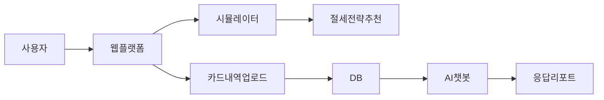

  

# FIT TAX : 절세금융상품 시뮬레이션 플랫폼

**프로젝트명** : 절세금융상품 시뮬레이션 플랫폼   

**목표** : 프리랜서, 청년 창업자, 개인사업자 등을 위한 **맞춤형 절세 전략 추천 및 시뮬레이션 서비스**

> 📉 세무사 비용 부담,  
> 📊 세무 지식 부족,  
> 🔍 단순 신고 대행에 그친 기존 서비스의 한계를 넘어  
> AI 기술을 활용해 **사용자 맞춤 절세 전략**을 제공합니다.

---

## 🧠 주요 기능

- 💡 **절세 전략 시뮬레이터**  
  사용자 진단 → 전략 추천 → 예상 환급액 확인 → 상품 가입까지

- 🔄 **카드 내역 기반 AI 분석**  
  카드 내역서 업로드 → 대시보드 시각화 → 세무 패턴 분석

- 🧾 **창업 필수 세무 상식 제공**  
  GPT를 활용한 동화형 콘텐츠 & 블로그 자동 발행

- 📊 **절세 금융상품 비교**  
  6개 상품군 기반 비교 대시보드 (IRP, ISA, 연금저축 등)

- 🤖 **AI 챗봇 및 자연어 질의 응답**  
  DB 기반 자동 질의응답 및 분석 리포트 생성

---

## 🛠️ 기술 스택

| 기술 | 설명 |
|------|------|
| **Python** | 데이터 분석, 크롤링, 백엔드 구현 |
| **Flask** | 웹 프론트 & 시뮬레이터 구현 |
| **LangChain** | 자연어 SQL 질의 처리 |
| **OpenAI GPT API** | 세무 콘텐츠 생성, 질의응답 |
| **SQL DB** | 상품 및 카드 내역 데이터 저장 |
| **streamlit  (또는 대시보드)** | 시각화 및 사용자 리포트 구성 |

---

## 📌 아키텍처

---

## 👥 Team Members

| |
|  |
|:-----------------------:|:-----------------------:|
| 변성용 (서비스 기획 / ) | 노호현 (서비스 기획/ )|
| 절세 시뮬레이터         |  블로그 자동화   |
| 카드사용 내역 자동화    |   크롤링 자동화    |
---

## 🧪 시연 예시

---

## 🔮 기대 효과

- 반복 가능한 절세 전략 설계
- 연령/소득별 시나리오 기반 추천
- 맞춤형 금융상품 탐색 → 가입 연계까지 원스톱 가능
- 실질 절세 체감과 재정습관 형성

---

## 📝 참고

- 네이버 지식인 데이터 기반 키워드 분석
- 구글플레이 세무 앱 리뷰 23,000건 이상 분석
- GPT 기반 사용자 맞춤 블로그 포스팅 시스템

